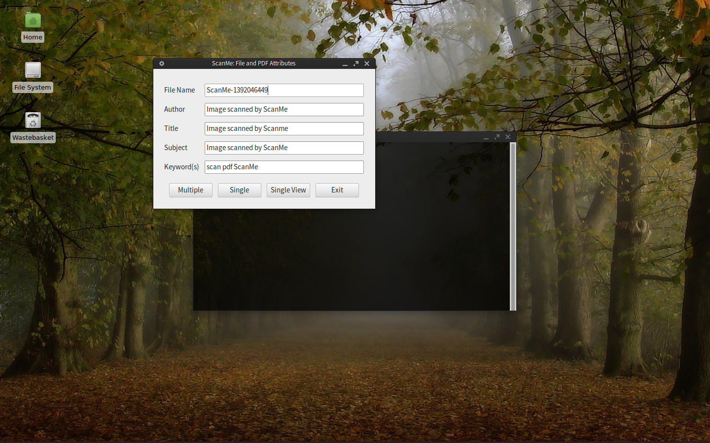

scanme-tools
============

scanme-tools was created to enable an HP 1220 AIO scanner and printer to be used under 32/64 bit Arch Linux / systemd / Gnome.  It could be useful for other devices but non-hp scanners (ie Epson, Brother or others for example) will require different drivers.  Obviously each manufacturer will do things in their own way.  

The scanme-tools scripts `scanme` and `install.sh` are written in Bash.  They are intended for use in Linux (Unix) systems.  

While we have used this script for some time, and have found it very reliable, it has not been extensively tested.  Therefore you may find a problem from time to time.  Please let us know about it.  

In the spirit of the open source movement, and to maintain compatability with certain dependencies, ScanMe Tools is offered under the terms of the GNU GPLv3 License.  

Motivation
----------

Why produce another set of tools, you say?  Well we find that the current tools are not complete, are not reliable, have dependency issues or have other drawbacks.  So this tool can scan document after document without problem.  At least that is our experience.  

Additionally, in practice we need files that are small, that can be sent as emails, and also files that are high quality, for archival purposes. This functionality is automatically included in this script.  

Features and Usage 
------------------

The application `scanme` installs under the desktop menu categories 'Multimedia' and 'Office' of Gnome, and is installed on the path /usr/local/bin. It can be invoked from the menu or a terminal window, but the behaviour from the terminal is different.  

When accessed from the menu (best), a properties window is used to invoke the application and a terminal provides backgorund messages just in case something goes wrong.  Post processing of files permits the scanned image or document to have metadata attached to it.  This metadata has default settings that the user can accept or change.  The properties window also permits multiple, single or single scan with view to be invoked.  The view will use a pdf viewer, as scans are .tiff files and these are converted to optimized .pdf.  

When invoked from the menu, ScanMe opens with an attributes window.  File names are generated with a unique string. There is no need to alter the default settings unless your archives require it.  

  

After selecting the scan type (ie. Single, Single View or Multiple), we pause and get ready to start:  

  

The final step of Single View scan type is illustrated below, using an Acrobat reader to view the file:  

  

From the terminal, ScanMe can be invoked as follows:  

    scanme [-s|--single|-v|--view|-m|--multi|-h|--help]  

The above arguments are optional and only one argument is accepted.  Calling `scanme` without arguments is the same as calling ScanMe from a menu, as shown in the screenshots above.  

However, when an option is given, the properties cannot be changed.  This is meant to offer a fast-track approach.  Option `[-s|--single]` permits a single page to be scanned, `[-v|--view]` permits a single page with view (either acroread, evince, xpdf or gv are invoked), and `[-m|--multi]` permits multiple pages with no view.  The option `[-h|--help]` produces the simple help message above.  

Scanned images are saved to a home subdirectory 'ScanMe-Work'. Two images are produced: .tiff and .pdf.  Each .tiff image tends to be about 6 to 7 MB size, typically, but the .pdf will be much smaller, around 200 to 400 KB.  

For multiple scans, each image file is sequenced as -0000.tiff to -9999.tiff/.pdf.  This sequence can be used to merge the images together if required.  At the moment ScanMe does not do this merging, but we are working on another set of PDF tools that can do this work.  

Configuration
-------------

We have found that CUPS+HPLIP is fine for printing, but that HPOJ is needed for proper scanning with HP All-In-One devices such as Laserjet and Officejet AIO.  Before installing, note that the package requires cups, sane, hplip, hpoj, libtiff (tiff2pdf), ghostscript and yad (a better Zenity).  Also gawk and coreutils is required, but this is generally not an issue on most Unix systems.  Both `install.sh` and `scanme` check these dependencies on each run.  

At the time of writing (February 2014), the HP configuration tools will require python 2.x.  So if strange errors occur, this is likely to be a cause.  If you have a system like ours, you may need to ensure that `python2` is invoked when these are run.  

This is systemd compatible, some systems may still use the older sysinit but eventually all sysinit will be replaced by systemd.  Red Hat, Gentoo and CentOS may still use sysinit, but just about all other major distributions use systemd since about 2012.  Note that HPOJ provides the ptal server and installs sysinit scripts by default.  

There are certain configuration that are documented within, and at the top of, the files `install.sh` and `scanme`.  You might want to check these just to see if there is anything of interest to you.  For example, there are three sets of svg and png icons: red (default), green and grey.  Also there is a trade off between the size and quality of the pdf conversion, the default setting `ebook` is mid-range, but if you do a lot of printed work rather than email transmission you may want to set this to 'prepress'.  The setting `screen` produces very small files, but the printed quality is not good.

Installation
------------

The script install.sh can be invoked to install and uninstall the system.  Options are:  
  
    sudo ./install.sh {install|uninstall}  
  
The above invocation should be done as a part of the procedure outlined below.  This is to ensure that the dependencies are correctly set up first.  When an existing file is found in /etc, it will be backed up with the extension .scanmesave.  This is only done the first time.  When uninstalled, these original files are restored and all .scanmesave files are then removed.  

For files installed under /usr, no backups are made, new files are either put in the target directory or, if the file already exists, it will be overwritten.  

Thus `./install.sh install` can be invoked more than once without uninstalling should the software need to be updated.  There is not much safety checking done and under this scenario we make no claims as to the integrity of the installation procedure.  You have been warned!

If sysinit is used, rather than systemd, then comment out the paths array entry for 'ptal.service' as follows:  
  
    # paths['ptal.service']='/etc/systemd/system'  
  
Thus for sysinit, you will probably get an error during installation, and you will have to manually ensure the ptal service is running and enabled.  Then, given a working Bash, awk, sed, and mktemp, do:  
  
- Install cups, sane, hplip, hpoj, libtiff (tiff2pdf), ghostscript, and yad.  
- Set up the aio device under cups and ensure it works properly.  
- Do `sudo hp-setup`, `sudo hp-plugins` and `sudo ptal-init`.  
- Do `hp-check -t` and copy the device string beginning with 'hpoj:mlc:'.  
- Edit `scanme` and set `readonly device={device of step above}`.  
- Modify if using sysinit, as indicated above, otherwise just invoke `./install.sh install`.  
  
To uninstall the system, invoke `./install.sh uninstall`.  This will reinstate the original files under /etc and will remove all previously installed files under /usr.

Copyright and License
---------------------
This work is written by G R Summers and is Copyright (C) Applied Numerics Ltd (AsymLabs), United Kingdom 2014. ScanMe tools is published under the license terms of the GNU GPLv2. No warranty is implied or expressed and use it at your own risk.  See file LICENSE in this directory for the specific terms of usage.  

If you are using this library or if you are experiencing problems please let us know.  Please contact the developers at dv@angb.co.

